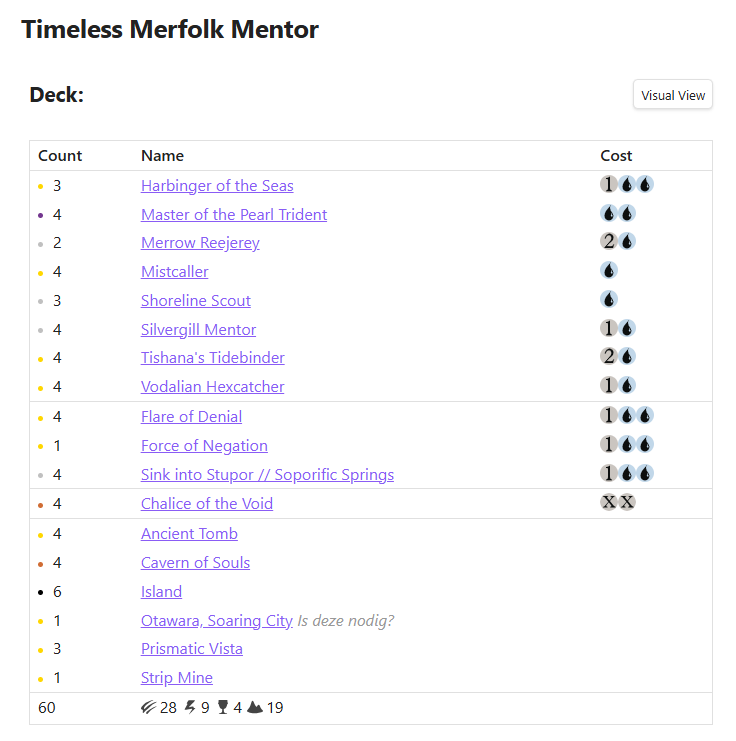
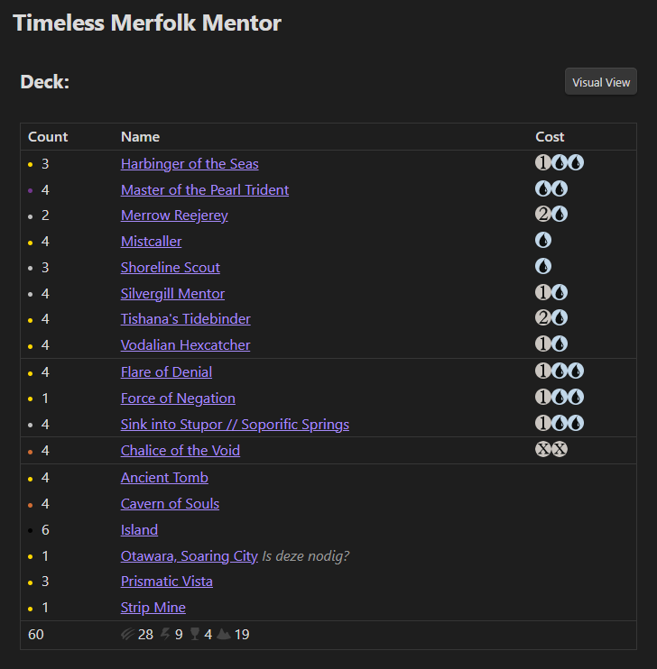
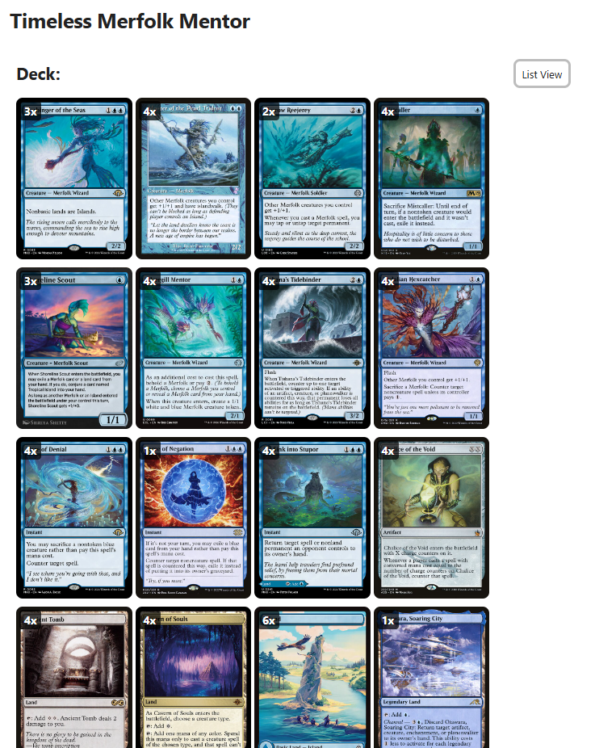
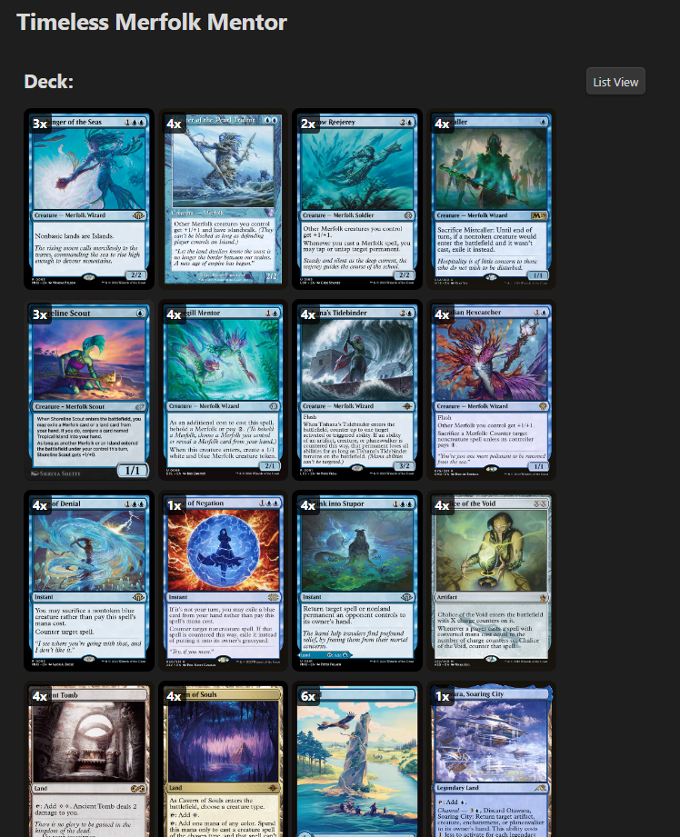
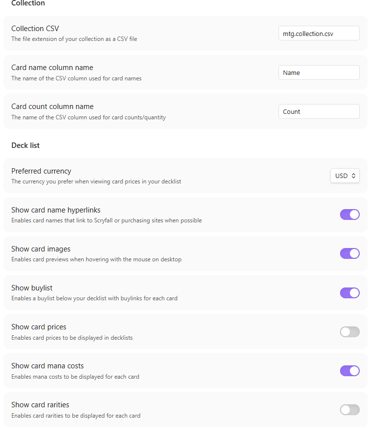

# MTG Deck

An Obsidian plugin for Magic: The Gathering players. Paste a decklist into a code block and get a richly formatted, interactive deck view — with card previews, mana costs, prices, type grouping, and more.

# ✨ Features

- **Instant rendering** — card names appear immediately, card data loads in the background
- **Card previews** — hover over any card to see a preview image
- **Double-faced card support** — click the preview image to flip between card faces
- **Mana cost symbols** — displays official mana symbols from Scryfall
- **Rarity indicators** — colored dot before each card count (black = common, silver = uncommon, gold = rare, orange = mythic)
- **Type grouping** — cards are automatically sorted and grouped by type (Planeswalker, Creature, Instant, Sorcery, Artifact, Enchantment, Land)
- **Type summary** — footer shows a count per card type with official card type icons
- **Card prices** — shows prices in USD, EUR, or TIX via Scryfall
- **Visual grid view** — toggle between list view and a visual grid of card images per section
- **Collection tracking** — tracks how many copies you own and highlights missing cards
- **Buylist** — automatically generates a buylist of missing cards
- **Format validation** — validates card legality per format (Modern, Legacy, Standard, etc.)
- **Multiple decklist formats** — supports standard MTGO, Arena, and Moxfield export formats
- **Hyperlinked card names** — optionally link card names to their Scryfall page
- **Section support** — supports multiple sections (Deck, Sideboard, Commander, etc.)

# 🖼️ Screenshots

 

 



# ⬇️ Installation

This plugin is not yet available in the Obsidian Community Plugin directory. Install it using [BRAT](https://github.com/TfTHacker/obsidian42-brat) (Beta Reviewers Auto-update Tool).

1. Install BRAT from **Settings → Community Plugins → Browse**, search for `BRAT`, install and enable it
2. Open **Settings → BRAT** and click **Add Beta Plugin**
3. Enter the repository URL: `https://github.com/sboulema/mtg-deck` and click **Add Plugin**
4. Enable the plugin under **Settings → Community Plugins**

BRAT will automatically notify you when updates are available.

# 🤲 Usage

Create a code block with the language set to `mtg-deck`:

````markdown
```mtg-deck
Deck:
4 Ragavan, Nimble Pilferer
4 Dragon's Rage Channeler
4 Murktide Regent
4 Counterspell
4 Brainstorm
4 Ponder
4 Force of Will
4 Daze
4 Lightning Bolt
4 Wasteland
12 Island
4 Volcanic Island
4 Scalding Tarn

Sideboard:
2 Pyroblast
2 Red Elemental Blast
3 Surgical Extraction
2 Grafdigger's Cage
2 Flusterstorm
4 Back to Basics
```
````

## Supported Decklist Formats

**Standard format**:
```
4 Lightning Bolt
4 Ragavan, Nimble Pilferer (MH2) 138
```

**Headed format**:
```
Deck:
4 Lightning Bolt

Sideboard:
2 Pyroblast
```

**Arena format**:
```
About
Name My Deck Name
Deck
4 Lightning Bolt
Sideboard
2 Pyroblast
```

## 💬 Comments

Inline comments can be added with `#`:

```
4 Otawara, Soaring City # Is this necessary?
1 Boseiju, Who Endures # Maybe cut?
```

Full-line comments start with `# `:

```
# Creatures
4 Ragavan, Nimble Pilferer
```

## 🔍 Format Validation

To validate a decklist against a [format](https://scryfall.com/docs/syntax#legality), append the format name to the code block language:

````markdown
```mtg-deck-modern
4 Lightning Bolt
4 Ragavan, Nimble Pilferer
...
```
````

Illegal or banned cards are shown in the section footer with a warning message.

# ⚙️ Settings

Open **Settings → MTG Deck** to configure the plugin:

| Setting | Description |
|---|---|
| **Show mana costs** | Display mana cost symbols in a Cost column |
| **Show card prices** | Display card prices in a Price column |
| **Preferred currency** | Choose between USD ($), EUR (€), or TIX (Tx) |
| **Show card previews** | Show card image on hover |
| **Show card names as hyperlinks** | Link card names to their Scryfall page |
| **Show buylist** | Show a buylist section for missing cards |

# 📦 Collection Tracking

This plugin expects your collection to be stored as CSV files with the extension `.mtg.collection.csv` by default.

These files are expected to be properly formed CSVs such as those generated by tools like [Deckbox](https://deckbox.org/).

Cards where you don't own enough copies are highlighted in red, and a count shows owned vs. needed (e.g. `2 / 4`). A **Buylist** section is automatically shown at the bottom when you're missing cards.

## Example CSV Files

```
Name,Count,Set
Delver of Secrets // Insectile Aberration,8,MID
"Otawara, Soaring City",4,NEO
"Rona's Vortex",2,DMU
```

```
Name,Count,Set
Delver of Secrets // Insectile Aberration,1,MID
"Otawara, Soaring City",6,NEO
"Rona's Vortex",3,DMU
Ledger Shredder,5,SNC
```

Note that your collection will consist of the merged result of all of your CSV files.

# 🙏 Credits

Built with the [Obsidian Plugin API](https://github.com/obsidianmd/obsidian-api) and [Scryfall API](https://scryfall.com/docs/api).

This is a fork of the original [obsidian-mtg](https://github.com/omardelarosa/obsidian-mtg) plugin.